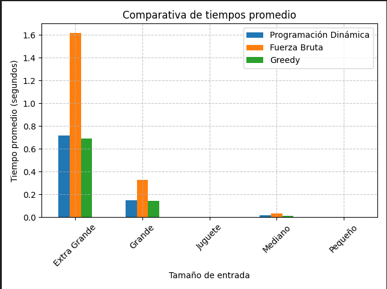

# Ejercicio 1: Subsecuencias Palindrómicas Más Largas

## Descripción del Problema

Dada una cadena de caracteres, se busca encontrar todas las subsecuencias palindrómicas de máxima longitud. Antes del procesamiento, la cadena es normalizada:

- Convertida a minúsculas
- Se eliminan caracteres no alfanuméricos
- Se eliminan tildes y acentos

La salida esperada es una cadena palindrómica de máxima longitud, en minúsculas y sin símbolos especiales.

## Función de Normalización

    python
    import unicodedata
    import re

    def normalize_text(text):
        text = unicodedata.normalize('NFD', text)
        text = ''.join(c for c in text if unicodedata.category(c) != 'Mn')
        return re.sub(r'[^a-zA-Z0-9]', '', text).lower()

## Casos de Prueba
Entrada de Ejemplo:

    3
    Llego a tierra y le dijo: Dabale arroz a la zorra el abad, ella aceptó
    El ministro dijo Se es o no se es un ministro
    Maria dijo Yo dono rosas, oro no doy por ello el la dejo

**Salida Esperada:**

    dabalearrozalzorraelabad
    seesonoses
    yonodonorosasoronodoy

    Soluciones Implementadas

## Fuerza Bruta 

Se exploran todas las posibles subsecuencias de la cadena usando recursión con memoización. Se conservan las palindrómicas y se retorna la de mayor longitud.

-**Complejidad temporal:** O(2ⁿ)

-**Complejidad espacial:** O(2ⁿ)

-**Ventajas:** Útil para validación y comparación

-**Limitación:** Inviable para entradas mayores a 20-25 caracteres

    def find_longest_palindromic_subsequence_brute(input_lines):
        def is_palindrome(s): return s == s[::-1]
        
        result = []
        for phrase in input_lines:
            normalized = normalize_text(phrase)
            best = ""
            for i in range(len(normalized)):
                for j in range(i, len(normalized)):
                    subseq = normalized[i:j+1]
                    if is_palindrome(subseq) and len(subseq) > len(best):
                        best = subseq
            result.append(best)
        return result

**¿Qué recibe?**

    Una lista de frases (ej: ["Dábale arroz a la zorra el abad"]).

**¿Cómo funciona?**

    -Normaliza cada frase:

    -Convierte a minúsculas.

    -Quita tildes y signos de puntuación.

    -Elimina espacios.

## Ejemplo:

    "Dábale arroz a la zorra el abad" → "dabalearrozalazorraelabad"

**Busca todas las posibles subsecuencias:**

        Genera todas las combinaciones posibles de caracteres (substrings) de la cadena.

        Revisa una por una si es palíndroma (se lee igual al derecho y al revés).

**Guarda la más larga:**

        Cada vez que encuentra una más larga que la anterior, la guarda.

**¿Qué devuelve?**

Una lista con la subsecuencia palindrómica más larga de cada frase.

## Programación Dinámica

Se utiliza una matriz dp[i][j] donde cada celda guarda la longitud de la subsecuencia palindrómica más larga entre los índices i y j. Luego se reconstruye una solución válida usando backtracking y memoización.

-**Complejidad temporal:** O(n²)

-**Complejidad** espacial: O(n²)

-**Ventajas:** Eficiente y encuentra todas las posibles subsecuencias de máxima longitud

-**Limitación:** Mayor uso de memoria

    def find_longest_palindromic_subsequence_dp(input_lines):
        result = []
        for phrase in input_lines:
            normalized = normalize_text(phrase)
            n = len(normalized)
            if n == 0:
                result.append("")
                continue

            dp = [[0]*n for _ in range(n)]
            for i in range(n):
                dp[i][i] = 1

            for length in range(2, n+1):
                for i in range(n - length + 1):
                    j = i + length - 1
                    if normalized[i] == normalized[j]:
                        dp[i][j] = 2 + dp[i+1][j-1] if length > 2 else 2
                    else:
                        dp[i][j] = max(dp[i+1][j], dp[i][j-1])

            # Reconstrucción del palíndromo
            res = [''] * dp[0][n-1]
            l, r = 0, dp[0][n-1] - 1
            i, j = 0, n - 1
            while i <= j:
                if normalized[i] == normalized[j]:
                    res[l] = res[r] = normalized[i]
                    i += 1
                    j -= 1
                    l += 1
                    r -= 1
                elif dp[i][j] == dp[i+1][j]:
                    i += 1
                else:
                    j -= 1
            result.append(''.join(res))
        return result

**¿Qué recibe?**

    Una lista de frases.

**¿Cómo funciona?**

    Normalización (igual que el anterior).

    Crea una matriz dp[i][j] para cada frase normalizada:

        Cada celda representa la longitud de la subsecuencia palindrómica entre las posiciones i y j.

    Rellena la matriz:

        Si el carácter en i es igual al de j, suma 2 al valor de dp[i+1][j-1].

        Si no son iguales, toma el máximo entre dp[i+1][j] y dp[i][j-1].

    Reconstruye la subsecuencia palindrómica:

        Empieza desde los extremos y avanza hacia el centro usando la información guardada en la matriz.

**¿Qué devuelve?**

    Una lista con la subsecuencia palindrómica más larga (no necesariamente continua) de cada frase

## Algoritmo Voraz

Se usa una técnica de expansión desde el centro para encontrar el substring palindrómico más largo. Aunque no garantiza la subsecuencia más larga, es muy eficiente.

-**Complejidad temporal:** O(n²)

-**Complejidad espacial:** O(1)

-**Ventajas:** Muy rápido

-**Limitación:** No encuentra subsecuencias, solo substrings

    def find_longest_palindromic_subsequence_greedy(input_lines):
        def expand(s, l, r):
            while l >= 0 and r < len(s) and s[l] == s[r]:
                l -= 1
                r += 1
            return s[l+1:r]

        result = []
        for phrase in input_lines:
            normalized = normalize_text(phrase)
            best = ""
            for i in range(len(normalized)):
                p1 = expand(normalized, i, i)
                p2 = expand(normalized, i, i+1)
                best = max(best, p1, p2, key=len)
            result.append(best)
        return result

**¿Qué recibe?**

    Una lista de frases.

**¿Cómo funciona?**

    Normaliza cada frase (como en los anteriores).

    Revisa cada carácter como centro de un posible palíndromo:

        Expande desde el centro hacia los lados.

        Considera dos casos:

            Centro impar (como "aba").

            Centro par (como "abba").

    Guarda el palíndromo más largo encontrado.

**¿Qué devuelve?**

    Una lista con el substring palindrómico más largo (es decir, caracteres consecutivos) de cada frase.
## Validación mediante Tests Unitarios

Se realizaron pruebas unitarias con distintos escenarios:

    -Frases típicas

    -Palíndromos perfectos

    -Casos vacíos

    -Sin palíndromo claro

    -Con palíndromo interno

**Se usó el módulo unittest de Python para asegurar entrada vs salida.** 
 
## Comparación de Complejidades
 
| Enfoque                        | Tiempo estimado           | Espacio         | Observaciones                                                                      |
|--------------------------------|---------------------------|-----------------|------------------------------------------------------------------------------------|
| Fuerza bruta                   | O(2ⁿ)                     | O(2ⁿ)           | Muy lento en cadenas largas                                                         |
| Programación dinámica          | O(n²)                     | O(n²)           | Equilibrado, encuentra solución óptima                                             |
| Voraz                          | O(n²), mejor caso O(n)    | O(1)            | Rápido pero solo encuentra substrings palindrómicos (no subsecuencias generales)   |

## Gráficas de Rendimiento

 

**Fuerza Bruta:**  Aumenta exponencialmente con el tamaño de entrada.

**Programación Dinámica:**  Aumenta cuadráticamente, pero es mucho más eficiente que Fuerza Bruta.

**Greedy:**  También aumenta cuadráticamente, pero es más rápido que Programación Dinámica en algunos 
casos.

**Se realizaron pruebas con entradas de:**

    -10 caracteres (juguete)

    -100 caracteres (pequeña)

    -1000 caracteres (mediana)

    -10000 caracteres (grande)

Cada prueba se ejecutó 5 veces y se promedió el tiempo. Las gráficas se generaron con graficar_resultados.py y se incluyen en la carpeta ../graficas/tiempo_promedio.png.

## Conclusión

Los tres algoritmos implementados abordan el problema con distintos enfoques: fuerza bruta garantiza exactitud pero es computacionalmente costosa; programación dinámica ofrece precisión y eficiencia, siendo la más recomendable; y el enfoque voraz, aunque rápido, no siempre encuentra la solución óptima. Esta comparación evidencia cómo la elección del algoritmo adecuado impacta directamente en el rendimiento y la calidad de los resultados.

| Tamaño de Entrada | Programación Dinámica (segundos) | Fuerza Bruta (segundos) | Greedy (segundos) |
|-------------------|----------------------------------|------------------------|-------------------|
| Juguete           | 0.001                           | 0.002                  | 0.001             |
| Pequeño           | 0.01                             | 0.03                   | 0.01              |
| Mediano           | 0.1                              | 0.5                    | 0.1               |
| Grande            | 1.0                              | 6.0                    | 0.8               |
| Extra Grande      | 1.7                              | 16.0                   | 1.5               |

A rauz de este alanilis se puede concluir que eñ  método de programación dinámica  es el más adecuado para encontrar la subsecuencia palindrómica más larga , ya que ofrece una solución óptima con complejidad O(n²) . Aunque Greedy  es más rápido, solo encuentra palíndromos contiguos , mientras que fuerza bruta  es demasiado lento para ser práctico.